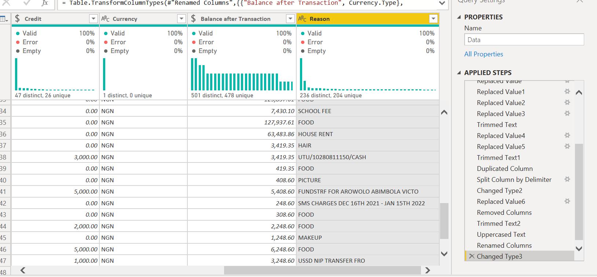
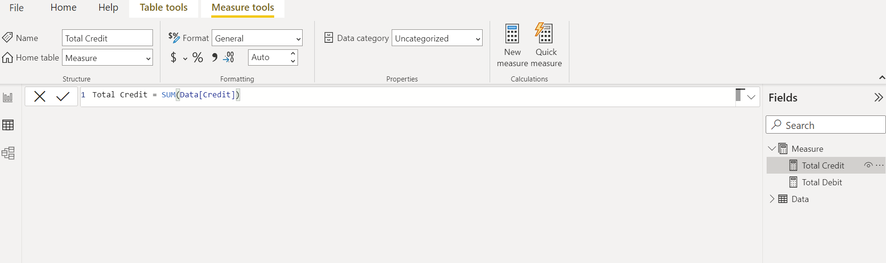
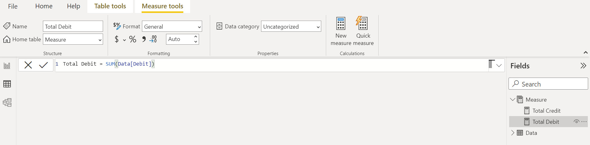
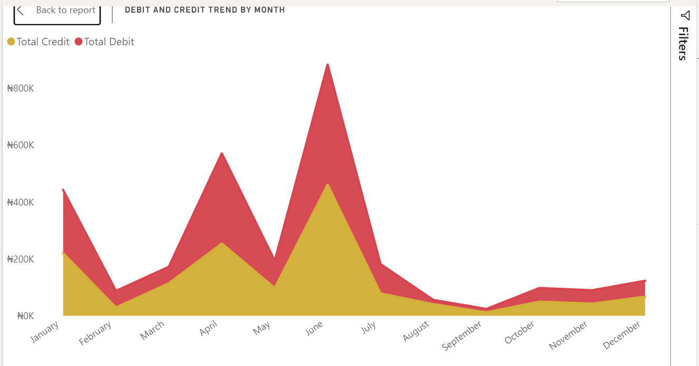
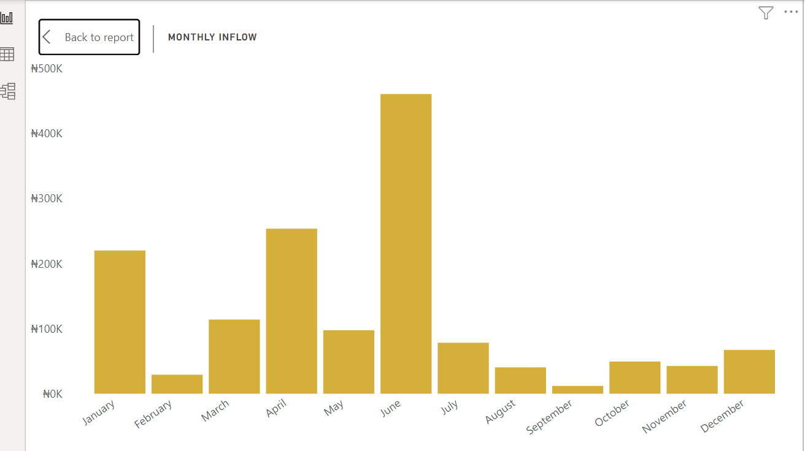
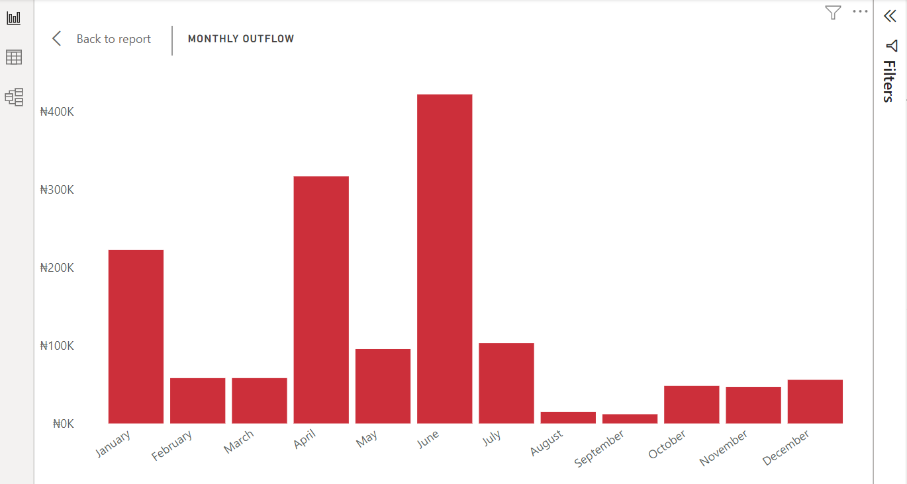
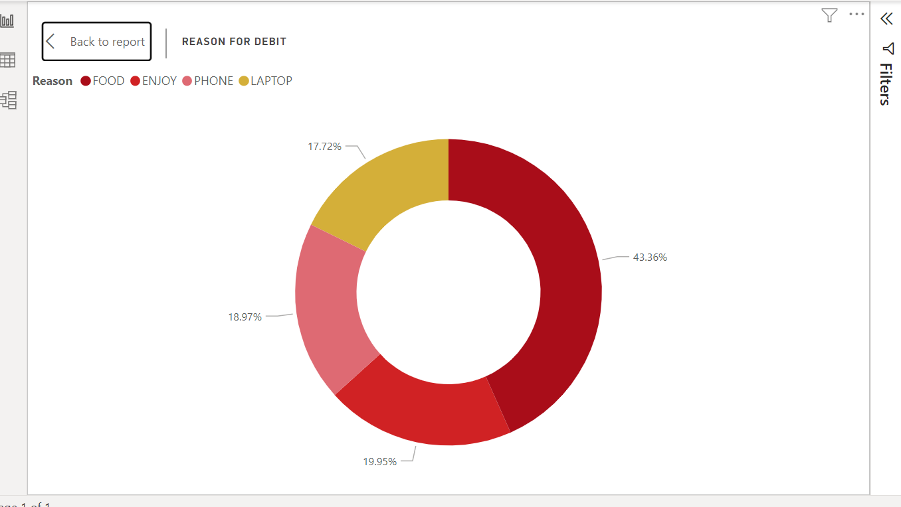
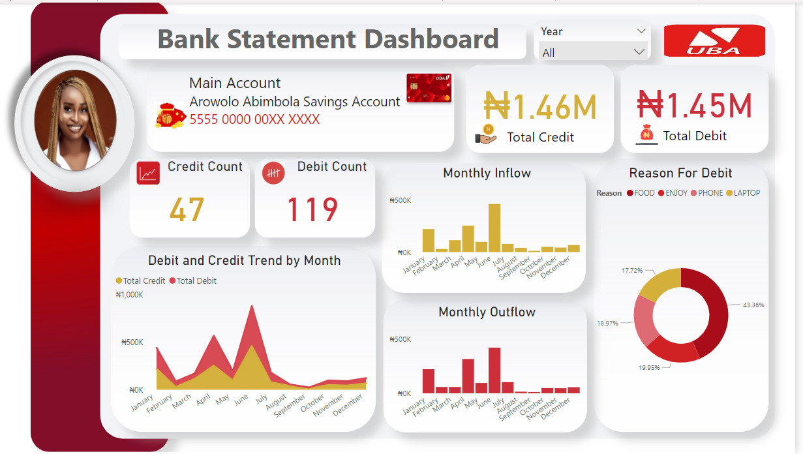

# Bank Statement Analysis

***

## Introduction

This is a Power BI project that shows analysis from the data gotten from my **Student** bank account.

The reason for this project is to track my spending and identify areas where i can cut costs and to also help me keep an eye on my budget to make sure I’m staying within financial limits.

The **goal** of this project is to gain a clear understanding of my income and expenses.

## Skills demonstrated for the project:

- Data Cleaning,
- Data Visualization,
- Quick Measure,
- Filters, Tooltips,
- Critical Thinking,
- Problem Solving.

## Problem statement:

1. To track credit and debit trend
2. Monthly inflow and outflow
3. Reasons for Debit Transactions in my Bank Account

## Data Sourcing:

After defining my problem statement , I obtained the data by downloading the csv file from my bank Mobile app and imported it into Power BI. 
Data was pulled from December 2021 to August 2023.
I cleaned the data, and then performed my analysis and created visualizations to help answer my questions.

## Data transformation/Cleaning:

The bank statement data was not in a clean format, so I had to clean and transform it before I could create the visuals. The Data was efficiently cleaned and transformed with the Power Query editor in Power BI.

Some of the applied steps include:

1. Making first role Headers

2. Changing Data Types

3. Split Description Column By Delimiter in Oder To Create The Reason Column.

The highlighted Column is the Newly Created Column. You can look through the applied steps as well.

4. Added Two Measures to show the Total Credit and Total Debit

Total Credit

Total Debit

## Data Modeling:

No Modeling was required since I need just a table for the analysis.

## Analysis and Visualization:

I chose to create simple and easy-to-understand visuals. To reflect the branding of my bank, I used their colors of red, white, and gold. These colors are also bold and eye-catching, which helps to make the visuals more memorable.
I wanted to ensure that the visualization would be easily understood by anyone who viewed it, regardless of their level of expertise.

I created a number of visuals to show the income, expenses, and top reasons for debit and added filters to the dashboard so that the user can customize the data.

### The Dashboard comprises of these visuals:

#### Debit and Credit Trend by Month:

1. My highest income was earned in June having 460,500.00 Naira.

2. My largest expenses were incurred in June having 421,859.59 Naira.

3. So far, 2023 has been my highest-earning year with a total income of 743.00 Naira.

#### Monthly Inflow:

1. My highest-earning month was June, with 460,500 Naira in income.

2. My lowest-earning month was September, with 12,000 Naira in income.🤓

#### Monthly outflow:

1. Month with highest spending was in June, having a total of 421,859 Naira.

2. Month with lowest-debit Transaction is September, having a total of only 11,895 Naira. 🤓 😄

#### Reason For Debit:

My food expenses accounts for the highest percentage of my total debits having 43.36%, which makes sense since I focus on eating healthy and well 😃

The enjoy category accounts for 19.95% of my total expenses. ‘Enjoy’ serves as a description for outflow transactions sent randomly to friends and family for upkeep — almost like giving out free money.

Expenditures on the phone constitute 18.97% of my total expenses. The ‘phone’ represents outflow transactions related to the purchase of a new phone. Meanwhile, expenses on the laptop account for 17.72%, with ‘laptop’ describing the outflow transactions for a new laptop purchase.

### Here is the Dashboard I came up with.

### You can interact with the report [here](https://app.powerbi.com/view?r=eyJrIjoiYTNlZDNkMzMtMWUyYS00ZGQ5LWEyMDMtZGMxNjllNTA3ZDc2IiwidCI6IjBmMzMzYzc0LTM2NzEtNGJkMy1hZjA1LTczNjc1OWI5ODkzZCJ9)

## Conclusion and Recommendation:

1. I realized that my expenses are greater than my income monthly, and I need to adjust my spending habits to bring them into balance.
   
2. I realized that I spend more money on food.
 I enjoy dining out and socializing, which contributes to my high food expenses. While I value these experiences, I need to consider whether there are areas where I can reduce my spending while still enjoying these activities.
   
4. I noticed that the month of June was a particularly busy and lucrative month,as it had the highest value for income and expense and I’m interested in identifying what made it so successful so I can replicate those conditions in the future.
   
5. I noticed that when I receive money, I tend to spend it immediately.
   
6. I want to work on budgeting and tracking my expenses so I can make informed decisions about my spending. I also want to create a savings plan so I can have a financial cushion for unexpected expenses. This will help me stay on track and achieve my financial goals.

#### Thanks for following through.

